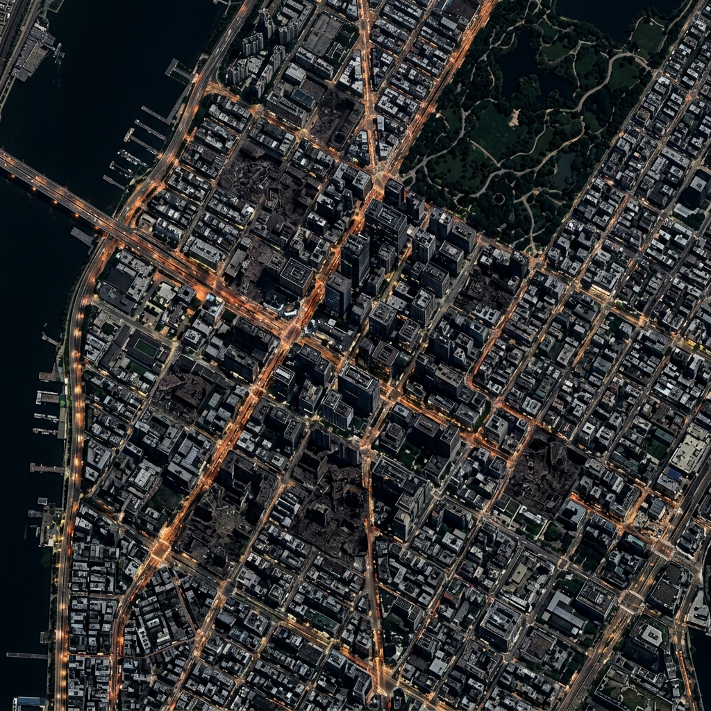

# 🧫 Protoplasm — Stigmergic SAR Swarm

 
*(Note: Example dashboard screenshot. The system features a fully interactive real-time simulation UI).*

**Protoplasm** is a decentralized, multi-agent autonomous drone swarm simulation designed for Search and Rescue (SAR) operations in degraded, communication-denied disaster environments. Inspired by the biological intelligence of *Physarum polycephalum* (slime mold), this project utilizes **stigmergic coordination** (digital pheromones) and peer-to-peer RF mesh communication to explore, coordinate, and cross-verify targets without any central command server or single point of failure.

By combining Edge-AI **Multi-Modal Sensor Fusion** (YOLOv8 for vision, fine-tuned YAMNet for audio, and passive thermal/gas sensing) with a **Dual-Axis Autonomous Architecture** (Environmental Cognition vs. Network/Resource Roles), the swarm effectively rejects false positives—such as hot debris or wind noise—and maintains network topology across complex terrain.

---

## ✨ Key Features
* **Decentralized Stigmergy:** Drones deposit and sense dynamic digital pheromones across a shared spatial substrate with strength-aware decay dynamics.
* **Dual-Axis Autonomy:** Decouples environmental perception regimes (`SPREAD`, `CONVERGE`, `SOLIDIFY`, `RESCUED`) from operational/network roles (`SCOUT`, `RELAY`, `SENTINEL`).
* **Multi-Modal Sensor Fusion:** Edge-AI inference combines visual data (YOLOv8) and acoustic data (YAMNet) to cross-verify potential targets ($C = 0.40 \cdot \text{YOLO} + 0.40 \cdot \text{YAMNet} + 0.20 \cdot \text{Passive}$).
* **Swarm Consensus & Decoy Rejection:** Drones initiate peer-to-peer radio debate and multi-angle verification. Single-channel false positives (thermal-only hot debris, audio-only wind spikes) are rapidly rejected.
* **Interactive Tactical Dashboard:** Military-grade HUD featuring live drone telemetry cards, satellite aerial imagery, dynamic Fog of War, agent debate speech bubbles, and scenario presets.

---

## 🛠️ Technology Stack
* **Frontend Simulation & HUD:** Vanilla JavaScript (ES6 Modules), HTML5 Canvas API, CSS3
* **Backend API Server:** Python 3 (Dual-Stack IPv4/IPv6 `http.server`)
* **Machine Learning Models:**
  * **YOLOv8** (`src/human_detector.pt`) — Custom visual human detection
  * **YAMNet** (`src/yamnet_binary_final`) — Fine-tuned TensorFlow audio/voice classifier
* **Mathematical Substrate:** NumPy, Box-Muller Gaussian noise modeling, Spatial Uncertainty Gradients

---

## 🚀 Getting Started

### 1. Prerequisites
* **Python 3.10 to 3.12** is recommended (Python 3.13 is also supported).
* Verify that model files are located in `src/`:
  * `src/human_detector.pt` (YOLOv8 model weights)
  * `src/yamnet_binary_final/` (TensorFlow SavedModel bundle)

### 2. Clone the Repository
```bash
git clone https://github.com/yourusername/protoplasm-swarm.git
cd protoplasm-swarm
```

### 3. Setup Virtual Environment & Install Dependencies
It is recommended to use a virtual environment to prevent system PATH dependency conflicts:

```bash
# Option A: Standard Python
python -m venv venv
venv\Scripts\activate          # On Windows
# source venv/bin/activate     # On macOS/Linux

# Option B: Using Windows py launcher (targeting Python 3.11 or 3.12)
py -3.11 -m venv venv
venv\Scripts\activate

# Install all requirements
pip install -r requirements.txt
```

*(Alternatively, install packages directly: `pip install ultralytics tensorflow numpy`)*

### 4. Run the Simulation API Server
The project serves both the web frontend and the Edge-AI ML Inference API from a single lightweight server:

```bash
python src/api_server.py
```
*(Or `py src/api_server.py` on Windows).*

### 5. Launch the Dashboard
Once the server starts and the neural networks finish calibration, open your browser and navigate to:
**[http://localhost:8080/index.html](http://localhost:8080/index.html)** (or `http://127.0.0.1:8080/index.html`)

---

## 🎮 Dashboard Controls & Telemetry
* **Play / Pause:** Toggle the active simulation loop.
* **Speed Slider:** Fast-forward simulation speed up to 12× for rapid benchmarking.
* **Drone Count:** Dynamically scale fleet size (2 to 60 drones) in real-time.
* **Scenario Select:**
  * `Disaster Zone (3 Survivors)`: Complex multi-casualty disaster map with ruins, gas plumes, and decoys.
  * `Multi-Survivor (2 Targets)`: Distributed dual-sector casualty search.
  * `Single Survivor`: Isolated target for benchmarking sensor filtering.
* **HUD Toggles:**
  * `🛰️ Satellite`: Toggle high-resolution aerial background imagery.
  * `🌫️ Fog`: Toggle dynamic Fog of War exploration shroud.
  * `🏗️ Overlay`: Toggle ground truth zone boundaries.
  * `💬 Agent Speech`: Toggle in-canvas peer debate dialogue boxes.
  * `🏠 Force RTL`: Manually command Return-To-Launch sequence.
* **Interactive Hover HUD:** Hover over any drone to inspect real-time battery, sector coordinates, raw multi-modal sensor values, altitude tier, dynamic role (`SCOUT` / `RELAY` / `SENTINEL`), and regime.

---

## 🧠 How It Works Under the Hood

### 1. Calibration-Time Model Inference
On startup, `src/api_server.py` executes genuine forward passes with YOLOv8 and YAMNet against synthetic, physically representative inputs (skin-tone thermal profiles and harmonic speech waveforms). This establishes class-conditional neural confidence distributions. During runtime, drones sample from these calibrated neural distributions with real-time vantage angle and altitude modulation.

### 2. Tri-Modal Sensor Fusion & Uncertainty Engine
At each tick, drones evaluate:
$$C = \text{consistency} \times (0.40 \cdot \text{YOLO} + 0.40 \cdot \text{YAMNet} + 0.20 \cdot \text{Passive})$$
$$V = \text{smoothstep}(0, 1, C \cdot (1 - U)^{1.8})$$

### 3. Dual-Axis Autonomy Layer
* **Regime (Environmental Perception):** `SPREAD` ($V < 0.30$), `CONVERGE` ($0.30 \le V < 0.68$), `SOLIDIFY` ($V \ge 0.68$), `RESCUED` (RTL).
* **Role (Network & Hardware Management):** 
  * `RELAY`: Bridges mesh partitions when drones move beyond the 6.0-unit radio range; holds station at $35\text{m}$ altitude.
  * `SENTINEL`: Low-battery safeguard ($\le 20\%$); suspends active sensor sweep to conserve power and hold position.
  * `SCOUT`: Default exploratory search state.

### 4. Physics-Informed Neural Networks (PINN Substrate)
* **Pheromone 2D Reaction-Diffusion PDE:**
  $$\frac{\partial P}{\partial t} = D \nabla^2 P - \gamma(x, y) P$$
  Trained offline via automatic differentiation Laplacians to model physical stigmergic vapor dissipation. Preserves high-confidence trails ($\gamma_{\text{low}} = 0.010$) while rapidly evaporating false-positive noise ($\gamma_{\text{high}} = 0.055$).
* **Battery Aerodynamics & Payload ODE:**
  $$\frac{dB}{dt} = -\frac{P_{\text{induced}}(z) + \frac{1}{2} C_D A \rho(z) v^3 + P_{\text{avionics}} + P_{\text{payload}}(\text{role})}{E_{\text{capacity}}}$$
  Models speed-cubed parasitic drag ($v^3$) and role payload power (`Scout: 0.028%/tick`, `Relay: 0.031%/tick`, `Sentinel: 0.011%/tick`).
* **Offline Training & Calibration:**
  ```bash
  python src/train_pinns.py
  ```
  Exports PyTorch models (`pinn_pheromone.pt`, `pinn_battery.pt`) and `pinn_calibration.json`, served via `/api/pinn/pheromone` and `/api/pinn/battery`.

---

## 📊 Benchmark Results Summary
*(From 100-Trial Monte Carlo Evaluation against baseline search strategies)*

| Metric | Protoplasm Swarm | Centralized Greedy | Lawnmower Sweep | Random Walk |
| :--- | :--- | :--- | :--- | :--- |
| **Mission Success Rate** | **99%** | 100% | 100% | 0% |
| **Coverage Efficiency** | **99.85%** | 99.0% | 100.0% | 96.75% |
| **Localization Error** | **0.78 ± 0.74 cells** | 0.99 ± 0.08 cells | 1.64 ± 0.80 cells | 1.13 ± 0.79 cells |
| **Detection F1 Score** | **0.99** | 1.00 | 1.00 | 0.30 |
| **Fault Tolerance (50% Kills)**| **94% Success** | Failed (SPoF) | Degraded | 0% |

---

## 📜 License
This project is open-source under the MIT License.
