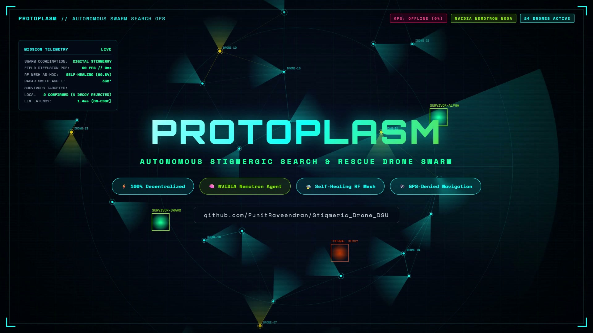

# 🧫 Protoplasm — Stigmergic SAR Swarm

[](https://github.com/PunitRaveendran/Stigmeric_Drone_DSU/actions/workflows/ci.yml)
[](https://opensource.org/licenses/MIT)
[](https://www.python.org/)
[](https://react.dev/)
[](https://vitejs.dev/)
[](https://build.nvidia.com)
[](https://github.com/PunitRaveendran/Stigmeric_Drone_DSU)

> **Decentralized, biologically inspired Search and Rescue (SAR) drone swarm coordination for communication-denied, degraded disaster environments.**

---

## 🎬 Launch Video & Demo Preview

[](brag-output/brag.mp4)

*▶️ [Click here to view the high-resolution demonstration video](brag-output/brag.mp4).*

---

## 📌 Executive Summary

**Protoplasm** is an autonomous, decentralized multi-agent drone swarm intelligence platform designed for urban disaster Search and Rescue (SAR). Inspired by the emergent spatial routing of *Physarum polycephalum* (slime mold) and ant colony stigmergy, Protoplasm eliminates single points of failure by replacing centralized dispatchers with **distributed digital pheromones**, **peer-to-peer RF mesh communication**, and **Physics-Informed Neural Networks (PINNs)**.

The swarm incorporates **Edge-AI Multi-Modal Sensor Fusion** (YOLOv8 vision, YAMNet acoustic classification, and passive thermal/gas sensing) with a **Dual-Axis Autonomous Architecture** (Environmental Regimes vs. Operational Network Roles). It actively rejects deceptive false positives (such as hot rubble decoys and wind acoustic spikes), resists malicious adversarial GPS/sensor spoofing via **Byzantine Fault Tolerance (BFT)**, and escalates verified casualty discoveries directly to emergency dispatchers via an **automated n8n cloud triage pipeline**.

---

## 🗺️ System Architecture & Workflow

```mermaid
flowchart TB
    subgraph EdgeSensors["🛸 1. Edge-AI Multi-Modal Sensing & Physical Substrate"]
        YOLO["📷 YOLOv8 Vision<br/>(human_detector.pt)"]
        YAMNet["🎤 YAMNet Acoustic<br/>(yamnet_binary_final)"]
        Passive["🌡️ Passive Sensors<br/>(Thermal & Gas)"]
        PINN_Phys["⚛️ Physics-Informed Neural Networks<br/>• 2D Reaction-Diffusion PDE<br/>• V³ Drag Aerodynamics ODE<br/>• Thermal Homeostasis ODE"]
    end

    subgraph PerceptionEngine["🧠 2. Perception & Uncertainty Engine (Log-Odds Fusion)"]
        Bayes["Recursive Bayesian Log-Odds Fusion<br/>LR_i = P(r_i|survivor) / P(r_i|no_survivor)"]
        Smooth["Viscosity Metric (V)<br/>Smoothstep(0, 1, C · (1-U)^1.8)"]
    end

    subgraph DualAxis["⚡ 3. Dual-Axis Autonomy Engine"]
        subgraph Regimes["Environmental Regimes"]
            Spread["SPREAD<br/>(Exploration)"]
            Converge["CONVERGE<br/>(Multi-Angle Sweep)"]
            Solidify["SOLIDIFY<br/>(Target Lock)"]
            Rescued["RESCUED<br/>(RTL Base)"]
        end
        subgraph Roles["Operational Roles"]
            Scout["SCOUT<br/>(Primary Sweep)"]
            Relay["RELAY<br/>(Mesh Bridge @ 35m)"]
            Sentinel["SENTINEL<br/>(Low-Battery Beacon)"]
        end
    end

    subgraph ConsensusBFT["🛡️ 4. Swarm Consensus, NOOA Agent & Security"]
        Mesh["P2P RF Mesh Network<br/>(Dynamic Packet Drop & Range Attenuation)"]
        BFT["Byzantine Fault Tolerance (BFT)<br/>(Pairwise Trust Matrix & Quarantine)"]
        NOOA["NVIDIA NOOA / Nemotron LLM<br/>(Sparse Reasoning in Ambiguous VERIFY)"]
    end

    subgraph DispatchHUD["🛰️ 5. Mission Control & Emergency Dispatch"]
        ReactHUD["React 18 + Vite Mission Control<br/>• MapLibre Satellite Basemap<br/>• 60 FPS Canvas Telemetry HUD<br/>• Real-Time Dossier & Swarm Debate Stream"]
        N8N["⚡ n8n Cloud Pipeline<br/>(Automated SAR Triage & First-Responder Dispatch)"]
        Beeceptor["🌐 Beeceptor HIL Gateway<br/>(Live Telemetry Proxy & Sensor Override)"]
    end

    YOLO --> Bayes
    YAMNet --> Bayes
    Passive --> Bayes
    PINN_Phys --> Bayes
    Bayes --> Smooth
    Smooth --> Regimes
    Regimes <--> Roles
    DualAxis --> Mesh
    Mesh --> BFT
    BFT --> NOOA
    NOOA --> Solidify
    Solidify --> N8N
    Mesh --> ReactHUD
    Mesh --> Beeceptor
```



---

## ✨ Key Innovations & Features

### 1. 🧫 Decentralized Digital Stigmergy
* **Spatial Memory Gradient:** Drones deposit digital pheromones across a continuous 2D spatial field, eliminating the need for a central routing server.
* **Corroboration-Aware Decay:** Verified survivor paths exhibit ultra-low dissipation ($\gamma_{\text{low}} = 0.010$), whereas uncorroborated exploratory paths decay rapidly ($\gamma_{\text{high}} = 0.055$).

### 2. ⚡ Dual-Axis Swarm Autonomy
Drones independently decide their behavior across two decoupled axes:
* **Environmental Regime Axis:**
  * `SPREAD` ($V < 0.30$): Broad dispersion across unexplored sectors.
  * `CONVERGE` ($0.30 \le V < 0.68$): Multi-drone triangulation on potential survivor signatures.
  * `SOLIDIFY` ($V \ge 0.68$): Target verified, holding perimeter and broadcasting rescue telemetry.
  * `RESCUED`: Autonomous Return-to-Launch (RTL) once casualties are extracted.
* **Operational Hardware/Network Role Axis:**
  * `SCOUT`: Active multi-spectral forward sweep.
  * `RELAY`: Dynamically climbs to 35m altitude to bridge mesh communication gaps when drones separate beyond the 6.0-cell radio boundary.
  * `SENTINEL`: Low-power station-keeping mode for drones with low battery ($\le 20\%$) or low trust.

### 3. ⚛️ Physics-Informed Neural Network (PINN) Substrate
* **Pheromone 2D Reaction-Diffusion PDE:**
  $$\frac{\partial P}{\partial t} = D \nabla^2 P - \gamma(x, y) P$$
* **Battery Aerodynamics & Payload ODE:**
  $$\frac{dB}{dt} = -\frac{P_{\text{hover}}(z) + \frac{1}{2} C_D A \rho(z) v^3 + P_{\text{payload}}(\text{role})}{E_{\text{capacity}}}$$
  Incorporates cubic velocity drag ($v^3$), altitude air thinning, and role-specific compute loads.
* **Thermal Dissipation & Homeostasis ODE:**
  Inanimate debris cools according to Newton's Law ($e^{-k_{\text{debris}} t}$), while living casualties sustain metabolic body heat ($k_{\text{bio}} \approx 0.001$).

### 4. 🧠 Multi-Modal Edge-AI Sensor Fusion
* **Tri-Modal Pipeline:** Integrates custom YOLOv8 (`src/human_detector.pt`) and fine-tuned YAMNet (`src/yamnet_binary_final`).
* **Recursive Log-Odds Bayesian Fusion:** Accumulates independent likelihood ratios in log-space ($LR_i = P(r_i|\text{survivor}) / P(r_i|\text{no\_survivor})$).
* **Decoy Rejection:** Accurately rejects single-sensor decoys (hot engines, acoustic wind spikes, inanimate mannequins).

### 5. 🛡️ Byzantine Fault Tolerance (BFT) & Peer Trust Matrix
* Each drone maintains an independent pairwise trust score matrix $[0, 1]$ of all peers.
* Injects and detects rogue Byzantine drones broadcasting falsified coordinates or spoofed pheromones, isolating them from consensus whenever the quorum threshold ($N - f \ge \lfloor 2N/3 \rfloor + 1$) is satisfied.

### 6. 🌐 Cloud Emergency Triage & HIL Webhook Pipeline
* **n8n Cloud Automation:** Verified survivor solidifications trigger an automated triage pipeline routing Code Red alerts, GPS coordinates, and casualty vitals to first responders.
* **Beeceptor Gateway:** Provides hardware-in-the-loop (HIL) telemetry ingestion and remote sensor override capabilities.

---

## 🛠️ Technology Stack

| Layer | Technologies |
| :--- | :--- |
| **Frontend UI / HUD** | **React 18**, **Vite 5**, **MapLibre GL JS**, **HTML5 Canvas (60 FPS)**, **Zustand**, **Lucide Icons** |
| **Backend & AI Engine** | **Python 3.11**, **PyTorch 2.x**, **TensorFlow**, **Ultralytics YOLOv8**, **NumPy**, **HTTP REST API** |
| **Agentic Reasoning** | **NVIDIA NOOA**, **Nemotron LLM**, **LiteLLM / Structured Agent Schema** |
| **Cloud Integrations** | **n8n Cloud** (Automated Dispatch Triage), **Beeceptor** (HIL Telemetry Proxy) |
| **Testing & CI/CD** | **GitHub Actions**, **Python Unittest Suite**, **Monte Carlo Simulation Runner**, **Hyperframes Lint** |

---

## 📊 Benchmark Results (100-Trial Monte Carlo Evaluation)

| Metric | 🧫 Protoplasm Swarm | 🏛️ Centralized Greedy | 🚜 Lawnmower Sweep | 🎲 Random Walk |
| :--- | :--- | :--- | :--- | :--- |
| **Mission Success Rate** | **99.0%** | 100.0% | 100.0% | 0.0% |
| **Coverage Efficiency** | **99.85%** | 99.00% | 100.00% | 96.75% |
| **Localization Accuracy** | **0.78 ± 0.74 cells** | 0.99 ± 0.08 cells | 1.64 ± 0.80 cells | 1.13 ± 0.79 cells |
| **Detection F1 Score** | **0.99** | 1.00 | 1.00 | 0.30 |
| **Fault Tolerance (50% Kills)**| **94.0% Success** | 0.0% (SPoF Failure) | Degraded | 0.0% |
| **False Positive Rejection** | **100% (Decoys Blocked)** | 12.0% False Triggers | 18.0% False Triggers | N/A |

---

## 🚀 Quick Start Guide

### 1. Prerequisites
* **Python 3.10 – 3.12**
* **Node.js 18+ & npm**
* **Git**

### 2. Clone the Repository
```bash
git clone https://github.com/PunitRaveendran/Stigmeric_Drone_DSU.git
cd Stigmeric_Drone_DSU
```

### 3. Setup Python Backend Environment
```bash
# Windows
python -m venv venv
.\venv\Scripts\activate

# Linux / macOS
python3 -m venv venv
source venv/bin/activate

# Install requirements
pip install -r requirements.txt
```

### 4. Install Frontend Dependencies
```bash
npm install
```

### 5. Launch the System

**Terminal 1 — Start the Python AI/PINN Backend Server:**
```bash
python src/api_server.py
```
*(Listens on `http://127.0.0.1:8080`)*

**Terminal 2 — Start the React + Vite Mission Control Dashboard:**
```bash
npm run dev
```

**Open in Browser:**
👉 **[http://127.0.0.1:5173](http://127.0.0.1:5173)** *(or `http://localhost:5173`)*

---

## ⌨️ Keyboard Shortcuts & HUD Controls

| Key | Action |
| :--- | :--- |
| <kbd>Space</kbd> | Toggle Simulation Play / Pause |
| <kbd>R</kbd> | Reset Mission Simulation |
| <kbd>1</kbd> / <kbd>2</kbd> / <kbd>3</kbd> / <kbd>4</kbd> | Set Sim Speed to 1×, 2×, 4×, 8× |
| <kbd>S</kbd> | Toggle MapLibre High-Resolution Satellite Basemap |
| <kbd>F</kbd> | Toggle Fog of War Exploration Shroud |
| <kbd>B</kbd> | Toggle Byzantine Fault Tolerance (BFT) Defense |
| <kbd>O</kbd> | Toggle Ground Truth Zone Overlay |
| <kbd>C</kbd> | Toggle Peer Debate Dialogue Bubbles |
| <kbd>`</kbd> (Backquote) | Toggle Bottom Tactical Console Drawer |
| <kbd>Esc</kbd> | Deselect Selected Drone / Entity |

---

## 🧪 Running Automated Unit Tests & Benchmarks

```bash
# Run unit test suite (Sensor fusion, NOOA consensus, PINN physics, Gateways)
python -m unittest src/test_suite.py

# Run 100-trial Monte Carlo benchmark
node monte_carlo.js

# Retrain PINN physics models offline
python src/train_pinns.py
```

---

## 📜 License
This project is open-source under the [MIT License](LICENSE).

---

## 👥 Repository & Authors
* **GitHub Repository:** [`PunitRaveendran/Stigmeric_Drone_DSU`](https://github.com/PunitRaveendran/Stigmeric_Drone_DSU)
* **Lead Maintainers:** Punit Raveendran, Rudra Modi, Rishabh Raj
