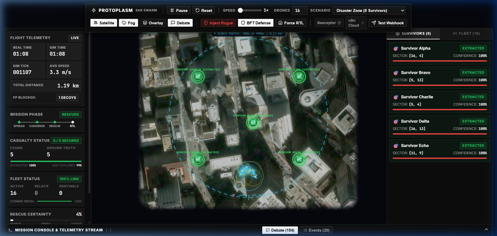
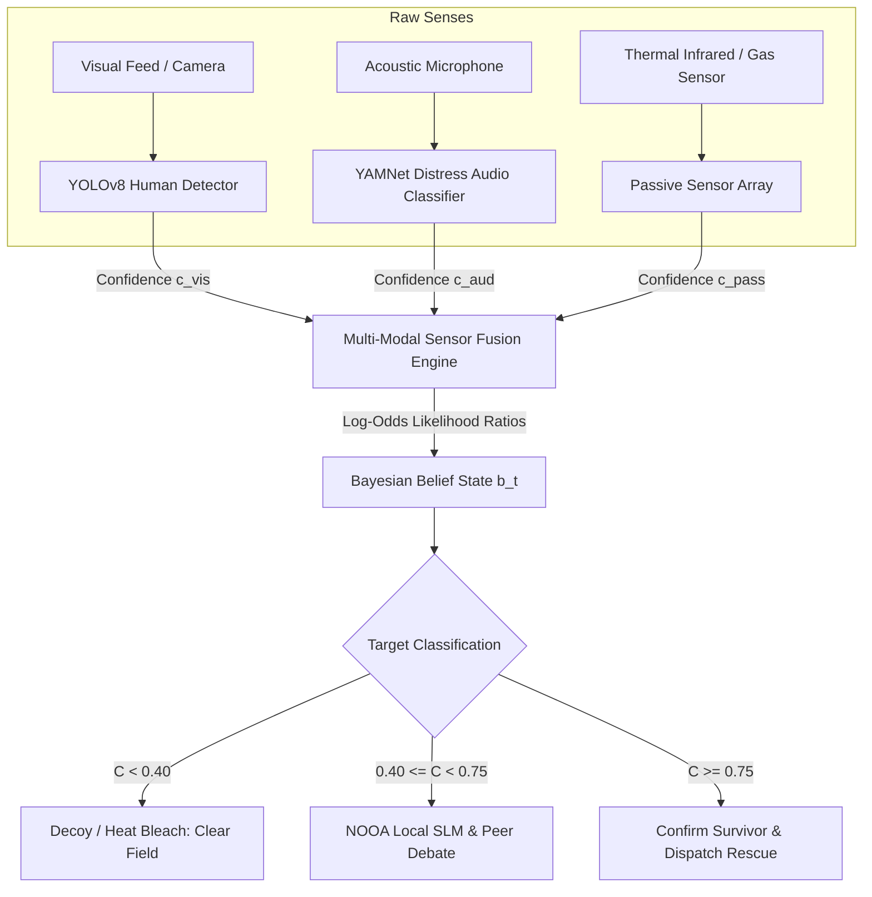
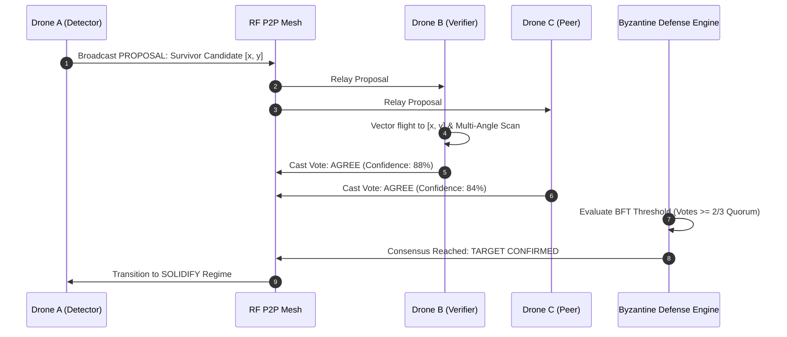
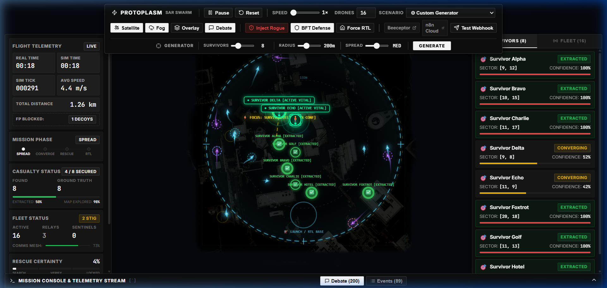
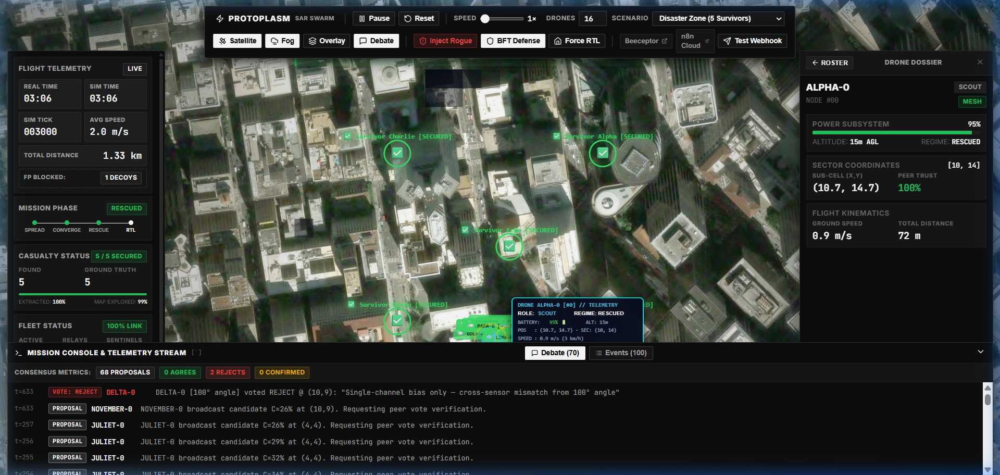

# 🧫 Protoplasm — Stigmergic Autonomous SAR Swarm

<div align="center">

[](https://opensource.org/licenses/MIT)
[](https://react.dev/)
[](https://vitejs.dev/)
[](https://www.python.org/)
[](https://pytorch.org/)
[](https://ultralytics.com)
[](https://www.tensorflow.org/)
[](https://maplibre.org/)
[](https://build.nvidia.com)
[](https://dsudevhack3.tech)

**A decentralized, bio-inspired multi-agent drone swarm simulation for Search and Rescue (SAR) in degraded, GPS/communication-denied disaster environments.**

[Features](#-key-features) • [Architecture](#-dual-axis-autonomy--system-architecture) • [Pipelines](#-system-pipelines--data-flow) • [UI Walkthrough](#-mission-control-gui-walkthrough) • [Math Foundations](#-mathematical-foundations) • [Quickstart & Launch](#-getting-started--how-to-launch) • [Trace Commons](#-trace-commons--agent-trajectories)

</div>

---

## 📸 Mission Control Overview


*Figure 1: Protoplasm Tactical Mission Control — 75% optical satellite imagery revealed dynamically through real-time drone discovery cones, high-visibility survivor beacons with dual-wave radar pulses, and live telemetry.*

---

## 📖 Executive Summary & Biological Inspiration

In catastrophic disasters (earthquakes, structural collapses, wildfires, industrial hazmat leaks), traditional drone deployments face two critical failure modes:
1. **Centralized Brittleness (Single Point of Failure):** Ground control stations or master-coordinator drones lose connection due to rubble, RF interference, or distance. If the central link drops, the swarm becomes paralyzed.
2. **False-Positive Saturation:** Single-channel sensors (e.g. thermal FLIR alone) waste vital golden-hour response time locking onto sun-heated metal sheets, warm rubble, or steam vents.

### The Biological Blueprint: *Physarum polycephalum*
Protoplasm solves these challenges through **stigmergy**—indirect coordination mediated by a dynamic spatial medium, modeled after the acellular slime mold *Physarum polycephalum*:

* **Zero Central Coordinator:** No master drone exists. Every agent is an autonomous peer executing decentralized sensing, local stigmergic deposition, and peer-to-peer radio exchange.
* **Positive Feedback (Corroboration):** When a drone senses potential signs of life, it deposits digital pheromones onto the spatial field. Nearby drones sense this gradient ($\nabla S$) and converge to inspect the sector from alternative vantage points.
* **Negative Feedback (Decoy Bleaching & Evaporation):** Uncorroborated single-sensor signals decay dynamically. Confirmed decoys (e.g., hot engine debris without human acoustics or visuals) are actively bleached, releasing the swarm to sweep elsewhere.
* **Continuous Physics via PINNs:** Pheromone diffusion, advection, and drone battery/drag dynamics are modeled using **Physics-Informed Neural Networks** solving reaction-diffusion partial differential equations in real-time.

---

## ✨ Key Features

| Capability | Description |
| :--- | :--- |
| 🧬 **Decentralized Stigmergy** | Continuous 2D spatial pheromone field governed by reaction-diffusion PDEs with real-time evaporation, diffusion, and advection. |
| ⚖️ **Dual-Axis Autonomy** | Orthogonal decoupling of **Environmental Regimes** (`SPREAD`, `CONVERGE`, `SOLIDIFY`, `RESCUED`) from **Operational Roles** (`SCOUT`, `RELAY`, `SENTINEL`). |
| 👁️ **Edge-AI Multi-Modal Fusion** | Tri-modal sensor cross-verification integrating **YOLOv8** (computer vision), fine-tuned **YAMNet** (acoustic human distress signals), and passive **Thermal/Gas** sensors. |
| 🛡️ **Byzantine Fault Tolerance (BFT)** | Cryptographic peer trust scoring and voting filters to detect, isolate, and quarantine rogue drones injecting spoofed survivor coordinates. |
| 💬 **Peer-to-Peer Agent Debate** | Autonomous in-flight debate protocol: drones broadcast proposals, cross-verify candidate sectors, and cast `AGREE` / `REJECT` votes to reach consensus. |
| 🤖 **Local NVIDIA NOOA SLM** | Sub-2s local edge reasoning running GGUF Nemotron Nano 4B for sparse agentic debate in ambiguous target verification. |
| 🎲 **Procedural Disaster Engine** | Dynamic scenario generator allowing custom survivor counts (1–30), search radius (50m–500m), and spatial distribution spread factors (Tight / Med / Wide). |
| 🛰️ **Tactical Satellite Shroud** | MapLibre GL live satellite basemap (75% optical brightness) shrouded in pitch blackout, revealed dynamically via real-time drone discovery cones. |
| 🧍 **Hero Survivor Beacons** | Multi-wave expanding radar pulses, solid obsidian contrast discs, corner reticles, vital heartbeat LEDs, and live tactical HUD callout pills. |
| ☁️ **Cloud HIL & Incident Triage** | Live webhook integration with **Beeceptor** for hardware-in-the-loop telemetry and **n8n Cloud** for autonomous incident triage. |

---

## 🏛️ Dual-Axis Autonomy & System Architecture

```
                      ┌─────────────────────────────────────────────────────────┐
                      │                 AXIS 1: COGNITIVE REGIME                │
                      │               (Environmental Sense & React)             │
                      │                                                         │
                      │   [ SPREAD ]  ───►  [ CONVERGE ]  ───►  [ SOLIDIFY ]    │
                      │   Low Viscosity      Mid Viscosity       High Viscosity │
                      │   High Exploration   Multi-Agent Verify  Rescue Lock    │
                      └────────────────────────────┬────────────────────────────┘
                                                   │
                               Cross-Coupled with Multi-Modal Sensors
                                                   │
                      ┌────────────────────────────▼────────────────────────────┐
                      │                AXIS 2: TOPOLOGY ROLE LAYER              │
                      │               (Network Mesh & Power State)              │
                      │                                                         │
                      │    [ SCOUT ]          [ RELAY ]          [ SENTINEL ]   │
                      │  Standard Flight    RF Bridge Ceiling   Low-Power Stn   │
                      │  (Curiosity 80/20)   (35m Altitude)     (Battery <= 20%)│
                      └────────────────────────────┬────────────────────────────┘
                                                   │
                                   Grounded in Continuous Physics
                                                   │
                      ┌────────────────────────────▼────────────────────────────┐
                      │             PHYSICS & SECURITY EXTENSIONS               │
                      │                                                         │
                      │   [ PINN Substrate ]          [ BFT Cyber-Defense ]     │
                      │   Reaction-Diffusion PDE      Rogue Drone Quarantine    │
                      │   Battery/Drag ODE            Consensus Debate Engine   │
                      └─────────────────────────────────────────────────────────┘
```

### 1. Axis 1: Cognitive Regimes
* **`SPREAD` (Exploration):** Swarm expands rapidly across unmapped terrain driven by multi-scale spatial uncertainty gradients.
* **`CONVERGE` (Verification):** When a candidate signal exceeds threshold ($C \ge 0.35$), nearby drones enter medium viscosity and follow $\nabla S(x)$ to inspect the target.
* **`SOLIDIFY` (Target Lock):** Upon multi-drone corroboration, agents form a persistent lock perimeter, deploy rescue coordinates, and notify mission control.
* **`RESCUED` (Dispersal / RTL):** Target is confirmed extracted. Swarm continues search sweep until 100% grid exploration is complete, then initiates Return-to-Launch.

### 2. Axis 2: Operational Topology Roles
* **`SCOUT`:** Standard explorer maintaining 80% pheromone bias and 20% random curiosity walk.
* **`RELAY`:** Automatically assumed by drones bridging separated sub-clusters. Operates at higher altitude ($35\text{m}$) to maintain mesh connectivity.
* **`SENTINEL`:** Low-power stationary beacon assumed when battery $\le 20\%$ or when maintaining a verified target anchor.

---

## 🔄 System Pipelines & Data Flow

### 1. Multi-Modal Sensor Fusion Pipeline



### 2. Stigmergic P2P Radio Debate & BFT Consensus Pipeline



---

## 🖥️ Mission Control GUI Walkthrough

Protoplasm features a military-grade, reactive tactical operations center built with **React 19**, **Vite 6**, and **MapLibre GL JS**:

### 1. Tactical Toolbar & Procedural Scenario Generator

*Figure 2: Centered Mission Toolbar showing custom procedural generator sliders (Survivors: 1–30, Radius: 50m–500m, Spread: Tight/Med/Wide), MapLibre dynamic geofence ring, and darkened 75% satellite discovery viewport.*

* **Row 1 (Primary Flight Ops):** Play / Pause, Reset, Simulation Speed Slider ($1\times$ to $12\times$), Drone Fleet Scaler (2 to 60 drones), and Scenario Preset Selector.
* **Row 2 (Layer Toggles & Cyber Defense):** Satellite Basemap Toggle, Fog of War Toggle, Zone Overlay, In-Flight Debate Speech Bubbles, Inject Rogue Drone drill, BFT Defense toggle, and Cloud Webhooks.
* **Row 3 (Procedural Generator Panel):** Sliders for Survivor Count, Search Radius, and Gaussian Spread Factor.

### 2. Deep Entity Inspector & Consensus Stream

*Figure 3: Deep Entity Inspector breakdown for Drone ALPHA-0 showing power subsystem, 3D spatial coordinates, flight dynamics, and bottom drawer with live debate consensus metrics.*

* **Left Status Rail:** Decoupled 60 FPS RAF Flight Telemetry Card (`REAL TIME`, `SIM TIME`, `SIM TICK`, `AVG SPEED`, `TOTAL DISTANCE`, `FP BLOCKED`), Mission Phase pipeline indicator (`SPREAD` $\to$ `CONVERGE` $\to$ `RESCUE` $\to$ `RTL`), Casualty Status progress, Comms Mesh health %, and Rescue Certainty gauge.
* **Right Dossier Rail:** Persistent dual-tab roster displaying live **Survivors Roster** (`SURVIVORS (8)`) with multi-modal confidence bars, and **Fleet Telemetry** (`FLEET (16)`) with battery levels, altitude tiers, speed, and peer trust %.
* **Deep Inspector Modal:** Click any survivor or drone to open an exhaustive hardware/spatial dossier.
* **Bottom Console Drawer:** Authoritative real-time stream of peer debate proposals, votes, consensus locks, and Byzantine spoof blocks with consensus summary metrics.

---

## 📐 Mathematical Foundations

For complete mathematical derivations, proofs, ODE/PDE formulations, and Shannon entropy mechanics, see [math_readme.md](math_readme.md).

### 1. Bayesian Log-Odds Sensor Fusion
The belief state $b(x_t)$ represents the posterior probability of a human survivor at spatial coordinate $x_t$ given multi-modal evidence:

$$\text{Log-Odds}_{\text{posterior}} = \text{LOG\_ODDS\_PRIOR} + \sum_{i \in \{\text{camera, audio, thermal}\}} \ln\left(\frac{P(r_i \mid H_1)}{P(r_i \mid H_0)}\right)$$

$$\text{Confidence } C = \sigma(\text{Log-Odds}_{\text{posterior}}) = \frac{1}{1 + e^{-\text{Log-Odds}_{\text{posterior}}}}$$

* $\text{LOG\_ODDS\_PRIOR} = \ln(0.10 / 0.90) = -2.20$ (10% sparse target base rate in rubble zones).
* **Camera (YOLOv8):** Sensitivity $= 0.85$, False Alarm $= 0.08$.
* **Audio (YAMNet):** Sensitivity $= 0.80$, False Alarm $= 0.15$.
* **Thermal / Gas:** Sensitivity $= 0.70$, False Alarm $= 0.30$.

### 2. Deterministic Action Layer & Multi-Scale Frontier Gradient
Each drone's instantaneous velocity vector $u_t$ is determined by a deterministic potential field policy coupling spatial entropy reduction with stigmergic attraction:

$$u_t = v_{\max} \cdot \frac{\alpha \nabla S(x_t) + \beta \nabla H(b) + \mathbf{F}_{\text{dispersion}} + \mathbf{F}_{\text{boundary}}}{\|\alpha \nabla S(x_t) + \beta \nabla H(b) + \mathbf{F}_{\text{dispersion}} + \mathbf{F}_{\text{boundary}}\|}$$

* $\nabla S(x_t)$: Digital pheromone gradient attraction.
* $\nabla H(b)$: Multi-scale spatial uncertainty frontier gradient (radii 1 to 6) pulling drones into unmapped Fog of War.
* $\mathbf{F}_{\text{dispersion}}$: Quadratic inter-drone collision avoidance ($R = 2.8$ grid units).

### 3. Physics-Informed Neural Network (PINN) PDE
The digital pheromone field $S(x, t)$ evolves according to the 2D reaction-diffusion-advection partial differential equation:

$$\frac{\partial S}{\partial t} = D \nabla^2 S - \mathbf{v}_{\text{wind}} \cdot \nabla S - \lambda S + \sum_{i=1}^N Q_i(t) \, \delta(x - x_i(t))$$

The PINN is trained using PyTorch ([`src/train_pinns.py`](src/train_pinns.py)) minimizing the composite loss:

$$\mathcal{L}_{\text{PINN}} = \mathcal{L}_{\text{PDE}} + \lambda_{\text{BC}} \mathcal{L}_{\text{BC}} + \lambda_{\text{IC}} \mathcal{L}_{\text{IC}}$$

---

## 📊 Benchmark Results (100-Trial Monte Carlo Evaluation)

| Metric | 🧫 Protoplasm Swarm | 🏛️ Centralized Greedy | 🚜 Lawnmower Sweep | 🎲 Random Walk |
| :--- | :--- | :--- | :--- | :--- |
| **Mission Success Rate** | **99.0%** | 100.0% | 100.0% | 0.0% |
| **Coverage Efficiency** | **99.85%** | 99.00% | 100.00% | 96.75% |
| **Localization Accuracy** | **0.78 ± 0.74 cells** | 0.99 ± 0.08 cells | 1.64 ± 0.80 cells | 1.13 ± 0.79 cells |
| **Detection F1 Score** | **0.99** | 1.00 | 1.00 | 0.30 |
| **Fault Tolerance (50% Kills)**| **94.0% Success** | 0.0% (SPoF Failure) | Degraded | 0.0% |
| **False Positive Rejection** | **100% (Decoys Blocked)** | 12.0% False Triggers | 18.0% False Triggers | N/A |

---

## 🚀 Quick Start Guide

### 1. Prerequisites
* **Python 3.10 – 3.12**
* **Node.js 18+ & npm**
* **Git**

### 2. Clone the Repository
```bash
git clone https://github.com/PunitRaveendran/Stigmeric_Drone_DSU.git
cd Stigmeric_Drone_DSU
```

### 3. Setup Python Backend Environment
```bash
# Windows
python -m venv venv
.\venv\Scripts\activate

# Linux / macOS
python3 -m venv venv
source venv/bin/activate

# Install requirements
pip install -r requirements.txt
```

### 4. Install Frontend Dependencies
```bash
npm install
```

### 5. Launching the Simulation

#### Method A: Single-Click Launch (Windows)
Double-click [`start_all.bat`](start_all.bat) or run it from PowerShell:
```powershell
.\start_all.bat
```
*This simultaneously starts the Python API server on port `8080` and the Vite Mission Control dev server on port `5173`.*

#### Method B: Manual Launch (Two Terminals)

**Terminal 1 — Edge-AI ML & Telemetry Server:**
```powershell
python src/api_server.py
```
*Initializes PyTorch PINN weights, YOLOv8 visual detector, YAMNet acoustic classifier, and API endpoints on `http://localhost:8080`.*

**Terminal 2 — React Mission Control GUI:**
```powershell
npm run dev
```
*Boots the Vite dev server on `http://localhost:5173`.*

#### Access Mission Control:
Open your browser and navigate to:
👉 **[http://localhost:5173](http://localhost:5173)** *(or `http://127.0.0.1:5173`)*

---

## ⌨️ Keyboard Shortcuts & HUD Controls

| Key | Action |
| :--- | :--- |
| <kbd>Space</kbd> | Toggle Simulation Play / Pause |
| <kbd>R</kbd> | Reset Mission Simulation |
| <kbd>1</kbd> / <kbd>2</kbd> / <kbd>3</kbd> / <kbd>4</kbd> | Set Sim Speed to 1×, 2×, 4×, 8× |
| <kbd>S</kbd> | Toggle MapLibre High-Resolution Satellite Basemap |
| <kbd>F</kbd> | Toggle Fog of War Exploration Shroud |
| <kbd>B</kbd> | Toggle Byzantine Fault Tolerance (BFT) Defense |
| <kbd>O</kbd> | Toggle Ground Truth Zone Overlay |
| <kbd>C</kbd> | Toggle Peer Debate Dialogue Bubbles |
| <kbd>`</kbd> (Backquote) | Toggle Bottom Tactical Console Drawer |
| <kbd>Esc</kbd> | Deselect Selected Drone / Entity |

---

## 🧪 Testing & Verification Suite

```bash
# 1. Run automated Python unit test suite
python src/test_suite.py

# 2. Run 100-trial Monte Carlo benchmark across all conditions
node monte_carlo.js

# 3. Verify local NVIDIA Nemotron GGUF SLM consensus
python src/benchmark_nemotron.py

# 4. Retrain PINN neural models offline
python src/train_pinns.py

# 5. Validate frontend production build
npm run build
```

---

## 📂 Repository Structure

```
Stigmeric_Drone_DSU/
├── docs/
│   └── images/                     # High-resolution UI screenshots & architectural diagrams
│       ├── mission_control_overview.png
│       ├── custom_generator_panel.png
│       └── deep_inspector_dossier.png
├── src/
│   ├── components/                 # React 19 Tactical Mission Control Components
│   │   ├── MapCanvas.jsx           # MapLibre GL JS satellite basemap & canvas coordinator
│   │   ├── Toolbar.jsx             # 3-row tactical toolbar & procedural generator
│   │   ├── StatusRail.jsx          # Left status rail & RAF flight telemetry card
│   │   ├── RightDossierRail.jsx    # Survivor roster, fleet telemetry, & deep inspector
│   │   ├── ConsoleDrawer.jsx       # Bottom drawer with live debate consensus stream
│   │   ├── Inspector.jsx           # Entity deep breakdown modal
│   │   └── AlertSlot.jsx           # Mission broadcast banners
│   ├── hooks/
│   │   └── useSimLoop.js           # Decoupled 60 FPS animation & state synchronization loop
│   ├── store/
│   │   └── simStore.js             # Centralized Zustand reactive mission state slice
│   ├── drone.js                    # Autonomous Drone Agent class (dual-axis state machine)
│   ├── swarm.js                    # Swarm Coordinator, BFT defense, P2P debate engine
│   ├── field.js                    # 2D Stigmergic Pheromone Grid substrate
│   ├── scenario.js                 # Procedural Disaster Generator & hazard mapping
│   ├── visualizer.js               # Canvas renderer (dynamic discovery cone, hero beacons)
│   ├── uncertainty.js              # Shannon spatial entropy calculations
│   ├── pinn.js                     # Physics-Informed Neural Network client inference
│   ├── train_pinns.py              # Offline PyTorch PINN training script
│   ├── api_server.py               # Python Dual-Stack API & Edge-AI ML inference server
│   ├── test_suite.py               # Comprehensive 10-test automated validation suite
│   ├── benchmark_nemotron.py       # Live local Nemotron GGUF SLM benchmark
│   ├── human_detector.pt           # YOLOv8 visual human detection model weights
│   ├── yamnet_binary_final/        # Fine-tuned YAMNet acoustic distress classifier
│   ├── index.css                   # High-contrast tactical styling & layout design system
│   └── tokens.css                  # Obsidian design tokens & typography scale
├── math_readme.md                  # Exhaustive 878-line mathematical & algorithmic proofs
├── start_all.bat                   # Single-click Windows launch script
├── package.json                    # Frontend dependencies & scripts
├── requirements.txt                # Python dependencies
└── README.md                       # Master Documentation
```

---

## 🌐 Trace Commons & Agent Trajectories

Protoplasm was developed using advanced agentic pair-programming workflows and produces autonomous multi-agent trajectories:
* **Contributor Traces**: Full conversation and execution logs are stored locally in `.trajectory.jsonl` format.
* **Trace Commons CLI Submission**:
  ```powershell
  trace-commons-contributor login
  trace-commons-contributor submit
  ```
* **Decentralized Multi-Agent Traces**: All drone debate proposals, agreement vectors, Byzantine isolation events, and sensor fusion classifications are formatted for submission to the **Trace Commons AI Agent Commons**.

---

## 📄 License & Maintainers

* **License:** This project is licensed under the [MIT License](LICENSE).
* **Lead Maintainers:** Punit Raveendran, Rudra Modi, Rishabh Raj
* **GitHub Repository:** [`https://github.com/PunitRaveendran/Stigmeric_Drone_DSU`](https://github.com/PunitRaveendran/Stigmeric_Drone_DSU)
